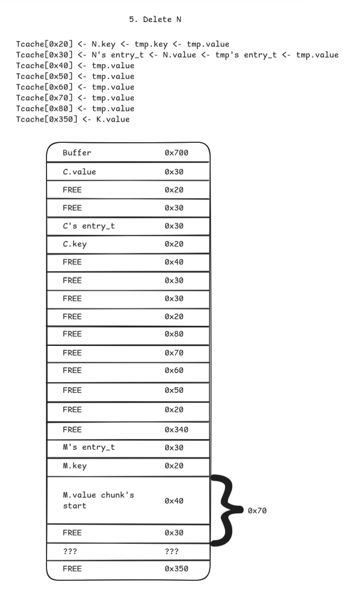

# Small primes shellcode

This challenge is the sixth most solved pwn challenge at the 2025 edition of the FCSC, rated as hard. I spent quite a lot of time on this one, learning about heap and libc stuff. Interesting but exhausting!

The following resources are provided:
 - a Dockerfile, for the execution environment
 - an address and a port to connect to

## Playing with the service

```
➜  06-conf-editor nc chall.fcsc.fr 2103     
Config Editor v0.1

-- Main Menu --
1. Import Config
2. Edit config
3. Quit
> 2
Configuration doesn't exist
```

Ok, lets try importing a new config:

```
➜  06-conf-editor nc chall.fcsc.fr 2103                          
Config Editor v0.1

-- Main Menu --
1. Import Config
2. Edit config
3. Quit
> 1
-- Import Menu --
Copy/Paste your config:
> aaaa


Ncat: Broken pipe.
```

As we'll see later, we need a specific format for this one:

```
➜  06-conf-editor git:(master) ✗ nc chall.fcsc.fr 2103 
Config Editor v0.1

-- Main Menu --
1. Import Config
2. Edit config
3. Quit
> 1
-- Import Menu --
Copy/Paste your config:
> [PLAYER]
name=micronoyau
level=n00b

Config Editor v0.1

-- Main Menu --
1. Import Config
2. Edit config
3. Quit
```

Let's try to edit the configuration now:

```
> 2
-- Edit Menu --
1. Add Entry
2. Del Entry
3. Mod Entry 
4. Back

Current config:
[PLAYER]
level = n00b
name = micronoyau
```

We can add, delete or remove key-value entries, or go back.

## Binary analysis

### Global insights

First, a quick `checksec` gives us some insights:

```
➜  06-conf-editor git:(master) ✗ checksec editeur-de-configuration
[*] '/home/micronoyau/Documents/CTF/ctfs/fcsc-2025/pwn/06-conf-editor/editeur-de-configuration'
    Arch:       amd64-64-little
    RELRO:      Full RELRO
    Stack:      Canary found
    NX:         NX enabled
    PIE:        PIE enabled
    RUNPATH:    b'.'
    SHSTK:      Enabled
    IBT:        Enabled
```

All protections seem to be maxxed out.

I used the provided docker image to pull out the libc version and the matching program interpreter. Turns out the service runs with the GNU libc version 2.35.

### Main loop

The program main loop looks something like this:

```
__int64 run()
{
  char choice; // [rsp+Bh] [rbp-35h]
  unsigned int ret; // [rsp+Ch] [rbp-34h]
  config_t config; // [rsp+10h] [rbp-30h] BYREF
  unsigned __int64 canary; // [rsp+38h] [rbp-8h]

  canary = __readfsqword(0x28u);
  ret = -1;
  memset(&config, 0, sizeof(config));
  do
  {
    puts("Config Editor v0.1\n");
    puts("-- Main Menu --");
    puts("1. Import Config");
    puts("2. Edit config");
    puts("3. Quit");
    printf("> ");
    choice = getchar();
    getchar();
    if ( choice == '3' )
    {
      ret = 0;
    }
    else if ( choice <= '3' )
    {
      if ( choice == '1' )
      {
        if ( config.first_entry )
          puts("Configuration file has been already loaded");
        else
          ret = import_config(&config);
      }
      else if ( choice == '2' )
      {
        if ( config.first_entry )
          ret = edit_config(&config);
        else
          puts("Configuration doesn't exist");
      }
    }
  }
  while ( choice != '3' && choice != -1 && !ret );
  free_config(&config);
  free(ptr);
  ptr = 0LL;
  return ret;
}
```

So the config is stored on the stack of what I called the `run` function. Speaking of config, here is the corresponding structure:

```
struct __fixed config_t // sizeof=0x20
{
    char description[24];
    entry_t *first_entry;
};
```

The so-called `description` field is actually not used at all in the entire program, so we dont really care about it.

### Importing a new configuration

Importing a new config happens in two steps. First, the program reads from stdin using the `getline` function (as it turns out, this function is also used in other functions for every large user input in the remainder of the program). So, user input is stored on the heap.

The user input is immediatly checked to see if it matches an expected header. If it does, the program parses line after line to add entries to the config.

```
__int64 __fastcall add_entries(config_t *config)
{
  __ssize_t line_length; // [rsp+18h] [rbp-18h]
  char *line; // [rsp+20h] [rbp-10h]
  entry_t *entry; // [rsp+28h] [rbp-8h]

  while ( 1 )
  {
    line_length = getline(&ptr, &n, stdin);
    if ( line_length == -1 )
      break;
    line = ptr;
    if ( !strncmp(ptr, "\n", line_length) )
      break;
    entry = parse_entry(line, line_length);
    if ( !entry )
      return 1LL;
    if ( config->first_entry )
    {
      entry->next = config->first_entry;
      if ( config->first_entry )
        config->first_entry->prev = entry;
      config->first_entry = entry;
    }
    else
    {
      config->first_entry = entry;
    }
  }
  return 0LL;
}
```

Turns out the underlying structure is a singly-linked list. The structure I named `entry_t` looks as follows:

```
struct __fixed entry_t
{
    char *value;
    char *key;
    __int64 value_length;
    entry_t *next;
    entry_t *prev;
};
```

Here is the function that parses a line to add an entry:

```
entry_t *__fastcall parse_entry(const char *line, __int64 line_length)
{
  entry_t *entry; // [rsp+18h] [rbp-38h]
  char *delimitor; // [rsp+20h] [rbp-30h]
  size_t key_length; // [rsp+30h] [rbp-20h]
  char *value; // [rsp+38h] [rbp-18h]
  unsigned __int64 value_length; // [rsp+40h] [rbp-10h]
  size_t n; // [rsp+48h] [rbp-8h]
  size_t na; // [rsp+48h] [rbp-8h]

  delimitor = strchr(line, '=');
  if ( delimitor )
  {
    key_length = delimitor - line;
    value = delimitor + 1;
    value_length = line_length - (delimitor - line) - 2;// exclude newline
    if ( (unsigned int)check_key(line, delimitor - line) )
    {
      entry = new_entry(key_length, value_length);
      if ( entry )
      {
        n = strcspn(line, " ");
        if ( n >= key_length )
          memcpy(entry->key, line, key_length);
        else
          memcpy(entry->key, line, n);
        na = strcspn(value, " "); // An entry's value can have a much larger chunk associated with it than the matching value_length -> might be used to leak data?
        if ( na >= value_length )
        {
          memcpy(entry->value, value, value_length);
        }
        else
        {
          entry->value_length = na;
          memcpy(entry->value, value, na);
        }
        return entry;
      }
      else
      {
        return 0LL;
      }
    }
    else
    {
      return 0LL;
    }
  }
  else
  {
    puts("incorrect line format");
    return 0LL;
  }
}
```

Something a bit odd can be noticed about this function: the value length of an entry is computed BEFORE the actual allocation happens. Indeed, the entry parsed from the line can contain trailing whitespaces, which are trimmed from the final value. But in the meantime, the final value still allocated the original parsed value length bytes. Which means that we might use this to leak some data since there will be no NULL byte to terminate `entry->value`.

Speaking of allocation, here is the content of the function `new_entry`:

```
entry_t *__fastcall new_entry(__int64 key_length, __int64 value_length)
{
  entry_t *entry; // [rsp+18h] [rbp-8h]

  entry = (entry_t *)malloc(0x28uLL);
  if ( !entry )
    return 0LL;
  entry->value = 0LL;
  entry->key = 0LL;
  entry->value_length = 0LL;
  entry->next = 0LL;
  entry->prev = 0LL;
  entry->key = (char *)malloc(key_length + 1);
  if ( !entry->key )
    return 0LL;
  entry->value = (char *)malloc(value_length + 1);
  if ( !entry->value )
    return 0LL;
  entry->key[key_length] = 0;
  entry->value[value_length] = 0;
  entry->value_length = value_length;
  return entry;
}
```

### Editing the configuration

Adding, deleting or modifying an entry act very similarly. Here is the corresponding disassembled code:

```
__int64 __fastcall edit_config(config_t *config)
{
  char choice; // [rsp+1Bh] [rbp-5h]
  int stop; // [rsp+1Ch] [rbp-4h]

  stop = -1;
  do
  {
    puts("-- Edit Menu --");
    puts("1. Add Entry");
    puts("2. Del Entry");
    puts("3. Mod Entry ");
    puts("4. Back\n");
    puts("Current config:");
    print_config(config);
    printf("> ");
    choice = getchar();
    getchar();
    if ( choice == '4' )
    {
      stop = 0;
    }
    else if ( choice <= '4' )
    {
      if ( choice == '3' )
      {
        stop = mod_entry(config);
      }
      else if ( choice <= '3' )
      {
        if ( choice == '1' )
        {
          stop = add_entry(config);
        }
        else if ( choice == '2' )
        {
          stop = del_entry(config);
        }
      }
    }
  }
  while ( choice != '4' && !stop );
  return 0LL;
}
```

```
__int64 __fastcall add_entry(config_t *config)
{
  unsigned int ret; // [rsp+1Ch] [rbp-14h]
  __ssize_t line_length; // [rsp+20h] [rbp-10h]
  entry_t *entry; // [rsp+28h] [rbp-8h]

  ret = 1;
  line_length = getline(&lineptr, &n, stdin);
  if ( line_length != -1 )
  {
    entry = parse_entry(lineptr, line_length);
    if ( entry )
    {
      entry->next = config->first_entry;
      if ( config->first_entry )
        config->first_entry->prev = entry;
      config->first_entry = entry;
      return 0;
    }
  }
  return ret;
}
```

```
__int64 __fastcall del_entry(config_t *config)
{
  unsigned int ret; // [rsp+1Ch] [rbp-14h]
  entry_t *entry; // [rsp+20h] [rbp-10h]
  __ssize_t line_length; // [rsp+28h] [rbp-8h]

  ret = 1;
  line_length = getline(&lineptr, &n, stdin);
  if ( line_length != -1 )
  {
    for ( entry = config->first_entry; entry && strncmp(entry->key, lineptr, line_length - 1); entry = entry->next )
      ;
    if ( entry )
    {
      if ( entry->prev )
        entry->prev->next = entry->next;
      if ( entry->next )
        entry->next->prev = entry->prev;
      if ( entry == config->first_entry )
        config->first_entry = entry->next;
      free(entry->value);
      entry->value = 0LL;
      free(entry->key);
      entry->key = 0LL;
      free(entry);
      return 0;
    }
    else
    {
      puts("key not found");
    }
  }
  return ret;
}
```

```
__int64 __fastcall mod_entry(config_t *config)
{
  unsigned int ret; // [rsp+14h] [rbp-1Ch]
  entry_t *entry; // [rsp+18h] [rbp-18h]
  entry_t *match; // [rsp+20h] [rbp-10h]
  __ssize_t line_length; // [rsp+28h] [rbp-8h]

  ret = 1;
  entry = 0LL;
  line_length = getline(&lineptr, &n, stdin);
  if ( line_length != -1 )
  {
    entry = parse_entry(lineptr, line_length);
    if ( entry )
    {
      for ( match = config->first_entry; match && strcmp(match->key, entry->key); match = match->next )
        ;
      if ( match )
      {
        if ( entry->value_length > (unsigned __int64)match->value_length )
        {
          // Mismatched sizes on two lines here
          match->value = (char *)realloc(match->value, entry->value_length);// Pb: value should be of size value_length+1
          match->value_length = entry->value_length + 1;// Pb: should be value_length
        }
        memset(match->value, 0, entry->value_length + 1);// Overflowing here
        memcpy(match->value, entry->value, entry->value_length);
        ret = 0;
      }
      else
      {
        puts("key not found");
      }
    }
  }
  if ( entry )
  {
    // entry->next and entry->prev are not cleared
    free(entry->value);
    entry->value = 0LL;
    free(entry->key);
    entry->key = 0LL;
    free(entry);
  }
  return ret;
}
```

However, there are several mistakes on the last function:
 - There is a bit of confusion between `value_length` and the actual size of the value in memory. In the `new_entry` function, malloc is done with size `value_length + 1` to account for the final null byte, so `entry->value_length` is actually one less than the total number of allocated bytes. But here, realloc is called with `value_length`, and memset with `value_length + 1`. To summarize: we can write a null byte right after the allocated memory area. Not much, but this will become handy as we will see shortly.
 - `entry->next` and `entry->prev` are not cleared after free. This might be used to leak data.

Pfew, that was a lot of code to take in (not as much as the http server challenge though). Let's see how to exploit it now :smiling_imp:.

## Exploiting the binary

Before starting, let me just put this disclaimer here: I went through a 3-day (and a whole night) long process to come up with this solution. I feel like there must have been something simpler, but hey we're here to have fun arent we?

### too long;wont read: the mastermind plan

If you dont feel like reading through this writeup, here are the general steps that summarize the exploit:
 - Leak heap address
 - Gain a chunk collision primitive
 - Leak libc address
 - Gain arbitrary read/write
 - Leak pointer guard
 - Hijack exit handlers
 - Restore heap state

### (Part 0). Initialize config

 1. Create a configuration and add a huge entry value. This will avoid `getline` from reallocating its memory area and prevent it from getting in our way
 2. Edit the config and remove this huge entry.

We are now ready to go!

### Part I. Leak heap address

This part is easy. Remember the structure of a malloc chunk (check out https://elixir.bootlin.com/glibc/glibc-2.35/source/malloc/malloc.c#L1153 and https://sourceware.org/glibc/wiki/MallocInternals for more details):

```
    chunk-> +-+-+-+-+-+-+-+-+-+-+-+-+-+-+-+-+-+-+-+-+-+-+-+-+-+-+-+-+-+-+-+-+
            |             Size of previous chunk, if unallocated (P clear)  |
            +-+-+-+-+-+-+-+-+-+-+-+-+-+-+-+-+-+-+-+-+-+-+-+-+-+-+-+-+-+-+-+-+
            |             Size of chunk, in bytes                     |A|M|P|
      mem-> +-+-+-+-+-+-+-+-+-+-+-+-+-+-+-+-+-+-+-+-+-+-+-+-+-+-+-+-+-+-+-+-+
            |             User data starts here...                          .
            .                                                               .
            .             (malloc_usable_size() bytes)                      .
            .                                                               |
nextchunk-> +-+-+-+-+-+-+-+-+-+-+-+-+-+-+-+-+-+-+-+-+-+-+-+-+-+-+-+-+-+-+-+-+
            |             (size of chunk, but used for application data)    |
            +-+-+-+-+-+-+-+-+-+-+-+-+-+-+-+-+-+-+-+-+-+-+-+-+-+-+-+-+-+-+-+-+
            |             Size of next chunk, in bytes                |A|0|1|
            +-+-+-+-+-+-+-+-+-+-+-+-+-+-+-+-+-+-+-+-+-+-+-+-+-+-+-+-+-+-+-+-+
```

We'll use the fact that small chunks are stored in the tcache in a LIFO manner. Combined with the "space trimming" and "freed entry_t->prev not cleared"  vulnerabilities previously found, we can allocate a chunk of size `0x30` (same chunk size as an `entry_t` chunk) but write only `0x20` bytes so that we can dump the `prev` field of an old `entry_t` chunk.

 1. Add entries A and B of size `0x20` and `0x30`, respectively.


 2. Delete these entries.


 3. Add C with `0x20` non-null and non-whitespace characters, followed by 7 whitespaces. The parsed entry will be of size `0x28` (null byte included), so the chunk will be of size `0x30`. But only the bytes up to whitespaces will actually be copied to the target entry's data, allowing to leak `A.prev` address.


### Part II. Get a chunk overlap primitive

This one is trickier. The whole process relies on the "overwrite one more null byte" vulnerability previously established. Basically, the idea is to overwrite the `P` bit of a chunk to zero. This bit is used internally by malloc to consolidate chunks that dont fit in a tcache bin or a fastbin during a `free` call. If the resulting chunk is not the top chunk, it is placed in the unsorted bin.

By merging with a chunk that is actually not freed, we can have chunks that overlap, which is going to be useful in the next parts.

It's always easier with figures :grin:

 1. Add entries `D`, `E`, `F` with sizes `0x20`, `0x4f8`, `0x48`, respectively.


 2. Delete `E`. This will place a chunk of size `0x500` in the unsorted bin (`F`'s purpose is to avoid `D` to merge with top chunk)


 3. Modify `D` so that the resulting chunk has size `0x500`. `E`'s purpose was to provide a correct chunk for the `parse_entry` function (which allocates a temporary entry). Now `F.value` is located right before `D.value`'s chunk.


 4. Modify `F` to perform the "null byte off by one" vulnerability. Since `D.value`'s chunk is of size `0x500` its size remains unchanged (which is why we opted for size `0x500`: first size that cannot be stored in tcachebin or fastbin and with least significant byte set to zero).


 5. Forge fake chunks `H` and `I` in `F` (yes I missed letter `G`, but Im too lazy to go back and modify every diagram) of size `0x30` each. This step is necessary to bypass checks in glibc's `unlink_chunk` function (https://elixir.bootlin.com/glibc/glibc-2.35/source/malloc/malloc.c#L1626)


 6. Delete `D`. Now `F` and the top chunk overlap!


### Part III. Leak libc

Let's use our neat primitive to dump libc's base ASLR address. The idea is the following: add and delete a large chunk so that it gets placed in the unsorted bin. Since this is the only chunk in the unsorted bin, its next chunk is itself. Malloc implements this by setting the `next` and `prev` pointers in the arena, `0x10` bytes before the associated bin's entry (in arena's bin array, so in libc!). See `malloc_state` structure for more details (https://elixir.bootlin.com/glibc/glibc-2.35/source/malloc/malloc.c#L1830).

Then, using the same vulnerabilities as for the heap leak, dump arena address.

 1. Add `J` and `K` of entries chunk size `0x420` (first no to go in tcache) and `0x350` (first chunk size above `0x340` that fits in a tcache bin).


 2. Delete `J` and `K`. `K`'s purpose was to protect `J` from being merged with top chunk.


 3. Delete `F` and add it back as `L` with `0x40` non-null and non-whitespace characters followed by `0x27` whitespace characters. Again, allocates back the `0x70` chunk but only memcopies the first `0x40` characters without null byte so we can leak libc.


### Part IV. Gain arbitrary read/write

The general idea of this part is to use the chunk overlap primitive to overwrite an `entry_t` to control the `value` pointer.

 1. Reset `L`'s `entry_t` size by deleting `L` and it adding back as `M` with size `0x5f`
 


 2. Reset next free broken chunk...


 3. ...so that we can allocate it again as `N`.


 4. Overwrite next chunk's size to `0x30`...


 5. ...so we can free it and add it to the tcache bin for a future `entry_t` allocation.



 6. Add entry `O` of size `0x40` to pop only `N`'s old `entry_t` chunk from the `0x30` tcache bin, and add entry `P`. Now `P`'s `entry_t` is right under the evil `M.value` chunk.


Now `M` can be edited to modify `P`'s `entry_t->value` field. This allows both dumping memory at this address (the program dumps every entry value after each action) and writing at this address (by modifying `P`).

### Part V. Leak pointer guard

#### Glibc pointer guard

Unfortunately, glibc version 2.35 enforces new security mechanisms. One of them is mangled pointers. To prevent an attacker from overwriting a pointer with an arbitrary value, pointers are (shifted and) XORed with a secret value known as the pointer guard (https://elixir.bootlin.com/glibc/glibc-2.35/source/sysdeps/unix/sysv/linux/x86_64/sysdep.h#L406):

```
#  define PTR_MANGLE(reg)	xor %fs:POINTER_GUARD, reg;		      \
				rol $2*LP_SIZE+1, reg
#  define PTR_DEMANGLE(reg)	ror $2*LP_SIZE+1, reg;			      \
				xor %fs:POINTER_GUARD, reg
```

This pointer guard is stored in the thread-local storage (TLS), pointed by the `fs` register in `x86_64`. The exact offset can be found by reading the disassembly of some glibc functions. Here for instance I show the disassembly of the `__call_tls_dtors` function which makes use of the `PTR_DEMANGLE` macro (https://elixir.bootlin.com/glibc/glibc-2.35/source/stdlib/cxa_thread_atexit_impl.c#L148):


This register can only be modified in supervisor mode, so there is no way to forge a "fake" TLS. The issue is that this storage is mapped at a random address in memory, independently from where libc, program and heap are loaded. So there is no easy way to guess `fs`'s value.

#### Using the program interpreter

However, luckily for us we dont need `fs` to dump `fs:0x30`, we just need what is stored at `fs:0x30`. And it turns out there is a copy of this pointer guard in the program interpreter memory, called `__pointer_chk_guard_local`!

To understand why, look at the `security_init` function:
```
static void
security_init (void)
{
  /* Set up the stack checker's canary.  */
  uintptr_t stack_chk_guard = _dl_setup_stack_chk_guard (_dl_random);
#ifdef THREAD_SET_STACK_GUARD
  THREAD_SET_STACK_GUARD (stack_chk_guard);
#else
  __stack_chk_guard = stack_chk_guard;
#endif

  /* Set up the pointer guard as well, if necessary.  */
  uintptr_t pointer_chk_guard
    = _dl_setup_pointer_guard (_dl_random, stack_chk_guard);
#ifdef THREAD_SET_POINTER_GUARD
  THREAD_SET_POINTER_GUARD (pointer_chk_guard);
#endif
  __pointer_chk_guard_local = pointer_chk_guard;

  /* We do not need the _dl_random value anymore.  The less
     information we leave behind, the better, so clear the
     variable.  */
  _dl_random = NULL;
}
```

This function itself is called in `dl_main` which is called at the startup of a dynamically-linked program (https://www.gnu.org/software/hurd/glibc/startup.html). Since neither `__pointer_chk_guard_local` or `security_init` symbols are exported, there is a bit of work to do in IDA to find the correct offset of `__pointer_chk_guard_local`. It happens to live `0x10` bytes before `_dl_argv` for glibc 2.35.

So here's the plan: leak `ld.so`'s base address to overwrite `P`'s `entry_t->value` with `__pointer_chk_guard_local`'s address. glibc uses `_dl_argv`, so a relocation exists in its `.got` section.

```
➜  06-conf-editor readelf -W -r libc.so.6 | grep _dl_argv
0000000000219e08  0000000200000006 R_X86_64_GLOB_DAT      0000000000000000 _dl_argv@GLIBC_PRIVATE + 0
```

#### Steps

 1. Overwrite `P`'s `entry_t->value` with the address of `_dl_argv` to dump it.
 2. Overwrite `P`'s `entry_t->value` with `_dl_argv - 0x10` (`__pointer_chk_guard_local`'s address) to dump the pointer guard.

### Part VI. Gain code execution

#### The struggles

This is the part I struggled the longest with. Initially, my plan was to overwrite `free` or `malloc` hooks, as I had always done in CTF challenges. However those symbols are deprecated and not used anymore since glibc 2.32 (https://developers.redhat.com/articles/2021/08/25/securing-malloc-glibc-why-malloc-hooks-had-go).

I searched for stack addresses to build a ROP chain, in vain. After a quick google search, I found that the new goldmine for pwn enjoyers was libc's `exit` function. I attempted several unsuccessful strategies:
 - This function first calls destructors with the `__call_tls_dtors` function. However, as its name suggests, the destructor function pointers are stored... in the TLS. Unless we leak this value (and it seems like a lot of work), its of no use.
 - At the end of the `_run_exit_handlers` function, the libc calls an exit hook. Unlike the previous point, this hook (function pointer) is stored in the `__libc_atexit` section. But this can contain only a single function pointer and we dont have any control over the argument passed to this function. I tried to find a one gadget, but all of them required a valid base pointer which was not the case.

#### Exit handlers

Finally, I found a working plan. When exiting a program, the libc calls `_run_exit_handlers` (https://elixir.bootlin.com/glibc/glibc-2.35/source/stdlib/exit.c#L38). This function parses a singly-linked list of function arrays (`exit_function_list` structure).

```
struct exit_function_list
  {
    struct exit_function_list *next;
    size_t idx;
    struct exit_function fns[32];
  };
```

For every index between `idx-1` and `0`, it processes the `exit_function` found and `fns[i]`.

```
enum
{
  ef_free,	/* `ef_free' MUST be zero!  */
  ef_us,
  ef_on,
  ef_at,
  ef_cxa
};

struct exit_function
  {
    /* `flavour' should be of type of the `enum' above but since we need
       this element in an atomic operation we have to use `long int'.  */
    long int flavor;
    union
      {
	void (*at) (void);
	struct
	  {
	    void (*fn) (int status, void *arg);
	    void *arg;
	  } on;
	struct
	  {
	    void (*fn) (void *arg, int status);
	    void *arg;
	    void *dso_handle;
	  } cxa;
      } func;
  };
```

One particular "flavour" of interest is the `ef_cxa`, since the expected exit handler has prototype `void (*fn) (void *arg, int status)` and since its argument `arg` can be controlled too.

By default, there is a single registered `exit_function` in a single `exit_function_list`, located in libc's `.data` section (defined as a global variable in https://elixir.bootlin.com/glibc/glibc-2.35/source/stdlib/cxa_atexit.c#L75). So we can simply overwrite add a handler to the list with our own function (`system`) and argument (`/bin/sh`, located in libc), and boom, `exit` should launch a shell for us!

### Part VII. Restore heap

Last part, pretty short. Simply restore heap so that all the calls to `free` wont make the program crash. For this purpose, I crafted a fake chunk of size `0x20` inside `M` and wrote its address to `P->value`.

## Results

The final exploit does not work 100% of time since it will fail to write any address containing a whitespace (`0x20`). Also, if we're not lucky some ASLR offset might contain a zero, which wont be dumped and the leak attempt will fail. The exploit takes almost 2 minutes to run, so there was a compromise to find to avoid the server kicking us out of the connection.


```
➜  06-conf-editor git:(master) ✗ python expl.py 
[*] '/home/micronoyau/Documents/CTF/ctfs/fcsc-2025/pwn/06-conf-editor/libc.so.6'
    Arch:       amd64-64-little
    RELRO:      Partial RELRO
    Stack:      Canary found
    NX:         NX enabled
    PIE:        PIE enabled
    SHSTK:      Enabled
    IBT:        Enabled
[*] '/home/micronoyau/Documents/CTF/ctfs/fcsc-2025/pwn/06-conf-editor/ld-linux-x86-64.so.2'
    Arch:       amd64-64-little
    RELRO:      Partial RELRO
    Stack:      No canary found
    NX:         NX enabled
    PIE:        PIE enabled
    SHSTK:      Enabled
    IBT:        Enabled
[*] Loaded 219 cached gadgets for './libc.so.6'
[+] Opening connection to chall.fcsc.fr on port 2103: Done

<lot of stuff printed out>

-- Main Menu --
1. Import Config
2. Edit config
3. Quit
> $ ls
editeur-de-configuration
flag.txt
$ cat flag.txt
FCSC{4e488d31cbb9fe91250c8a239a66d9d7393cc1d90b137dcf71323e81aa1d30d3}
```

Awesome :smile:
